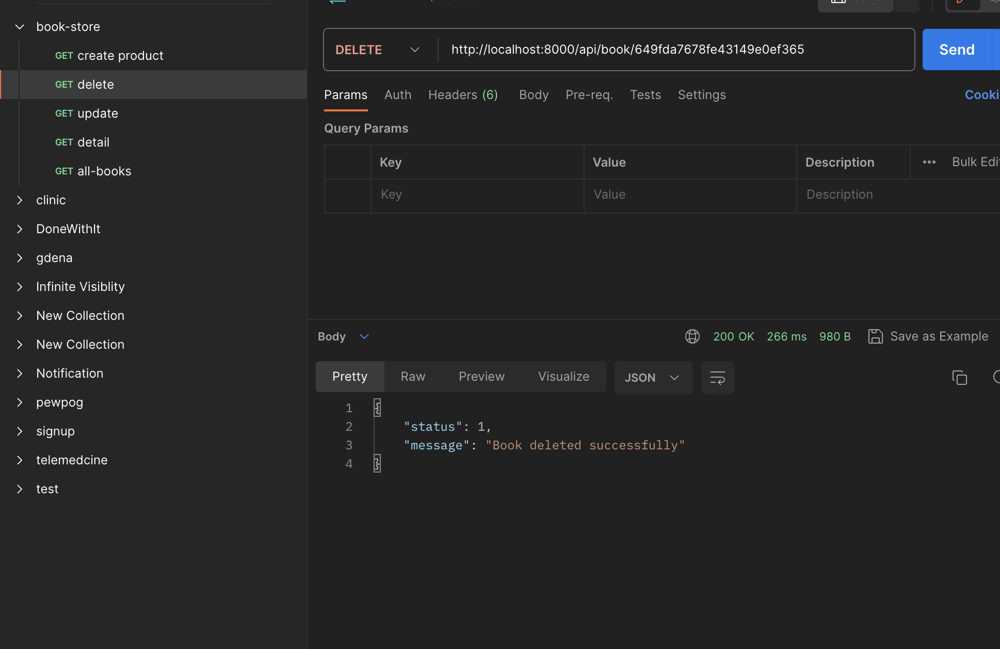
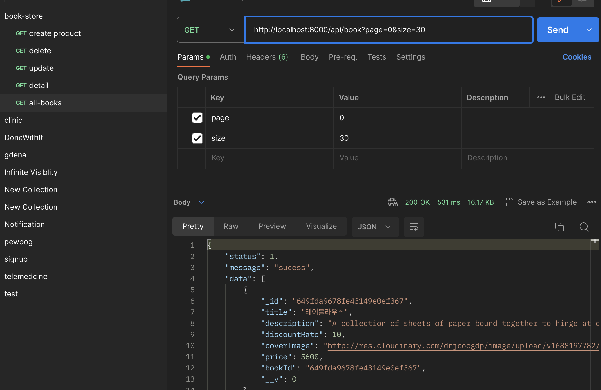
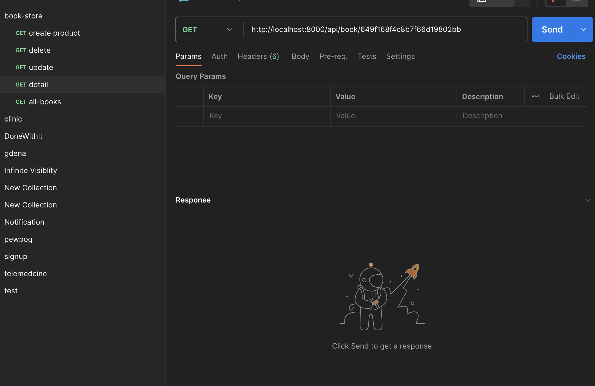

### cd backend

# BookStore

live backe end server https://book-store-0aph.onrender.com
download the app to test the server form
https://expo.dev/accounts/hayelom/projects/Book-Store/builds/dc5c361a-879d-4f3b-8a5f-f2e73f6a7599

## Installation

Install my-project with npm

```bash
  git clone https://github.com/hayelom123/book-store.git
  //add .env variables
  cd backend npm i
  npm start

```

## Create product

.env //create environment variable in backend folder with the following variables

```bash
  NODE_ENV
  HOST
  PORT
  MONGODB_URL
  cloud_name
  api_key
  api_secret
  JWT_SECRET
  JWT_ACCESS_EXPIRATION_MINUTES
  JWT_REFRESH_EXPIRATION_DAYS
  JWT_RESET_PASSWORD_EXPIRATION_MINUTES
  JWT_VERIFY_EMAIL_EXPIRATION_MINUTES

```

## Create Book

then create some books
like the following

http://localhost:8000/api/book [post]//create or upload new product

```
 //types for data post
  title  //string
  description //string
  discountRate //number
  coverImage //file
  price   //number
```


## Delete Book



## Get All Books



## Get Book Detail


